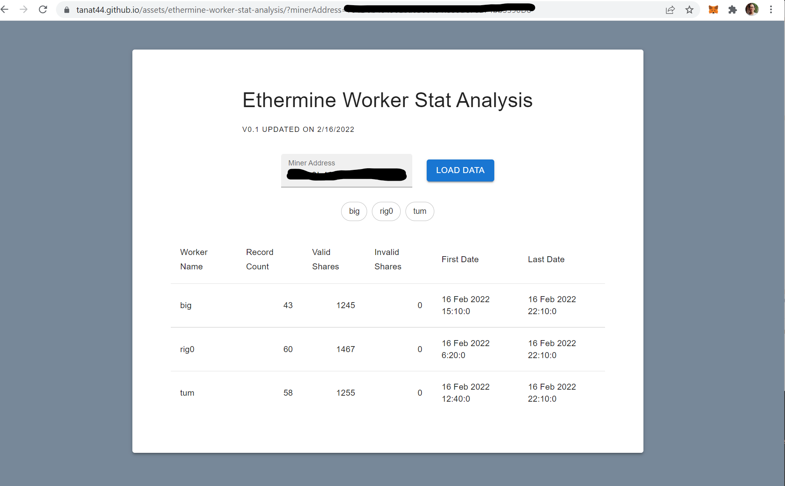

# Ethermine Worker Statistic Web Analysis

I tried ETH mining recently. After having few friends joining the mine on the same pool to accelerate the payout, I would like to have historical statistic of each workers. On the dashboard of Ethermine (ETH mining pool), only the daily stat of workers are visible. Then, I saw the open API and I thought I could get more data by using the API, so I started building a small react web app that does the job.

After an hour into the project I found out that information available over the API is also limited to 1 day of history ... My app doesn't add any addition value, compared to the original dashboard. I finished up by building it and hosted at this [tanat44.github.io](https://tanat44.github.io/assets/ethermine-worker-stat-analysis/?minerAddress=791D0b40490Eba6B00191f559aC7ed74bb3390D8)


## Things I learn
1. Create a small React app. I used to a web app with many pages. React is fast! I spent 2 hours including testing api, code, and deploy. It's a small apps with all the libs I ever needed for a big one.
1. I learnt that ```index.html``` and ```asset-manifest.json``` use some absolute script references. In order to make it serve statically (hosted in github.io in my case), I tried change the absolute ones to relative paths. It works